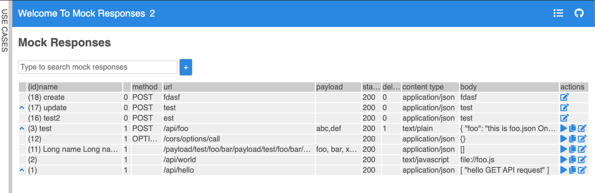
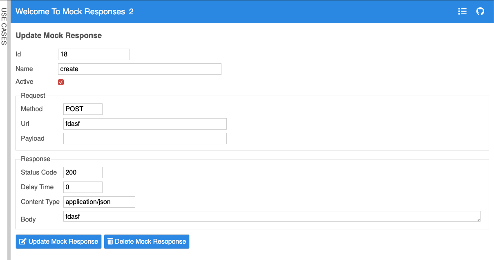
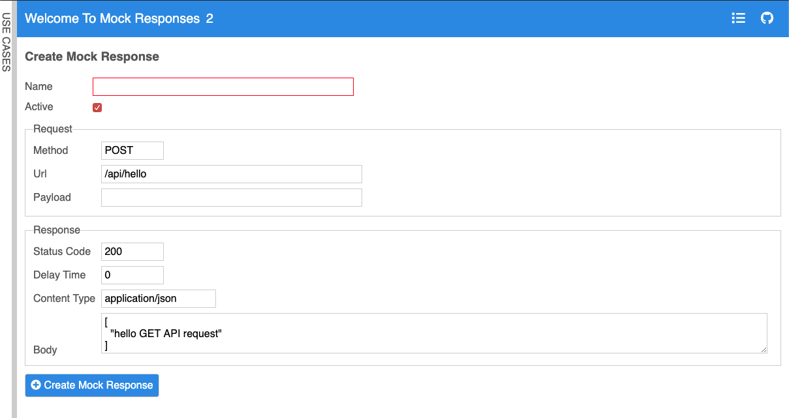

## **Table of Contents**
- [Mock Response Payload & Sample Responses](#mock-response-payload--sample-responses)
  - [GET /mock-responses](#get-mock-responses)
  - [GET /mock-responses/:edit](#get-mock-responsesedit)
  - [GET /mock-responses/new](#get-mock-responsesnew)
  - [GET /mock-responses/:id](#get-mock-responsesid)
  - [POST /mock-responses](#post-mock-responses)
  - [PUT /mock-responses/:id](#put-mock-responsesid)
  - [PUT /mock-responses/:id/activate](#put-mock-responsesidactivate)
  - [DELETE /mock-responses/:id](#delete-mock-responsesid)

<br>

# Mock Response Payload & Sample Responses

## GET /mock-responses

*Visit the home page.*

**Payload:** `N/A`

**Sample Response:**
```json
{
   "est":{
      "id":16,
      "updated_at":"2019-10-15T19:00:46.443Z",
      "count":1,
      "data":[
         {
            "id":16,
            "name":"test3",
            "active":1,
            "req_url":"est",
            "req_method":"POST",
            "res_status":200,
            "res_delay_sec":0,
            "res_content_type":"application/json",
            "res_body":"test",
            "created_at":1570211999314,
            "created_by":"allen.kim",
            "updated_at":1571166046443,
            "updated_by":"raj.pandya",
            "req_payload":""
         }
      ]
   },
   "fdasf":{
      "id":18,
      "updated_at":"2019-10-15T18:47:53.121Z",
      "count":1,
      "data":[
         {
            "id":18,
            "name":"create",
            "active":0,
            "req_url":"fdasf",
            "req_method":"POST",
            "res_status":200,
            "res_delay_sec":0,
            "res_content_type":"application/json",
            "res_body":"fdasf",
            "created_at":1570212192308,
            "created_by":"allen.kim",
            "updated_at":1571165273121,
            "updated_by":"raj.pandya",
            "req_payload":""
         }
      ]
   },
   "/api/foo":{
      "id":3,
      "updated_at":"2019-10-15T18:45:29.832Z",
      "count":3,
      "data":[
         {
            "id":3,
            "name":"test",
            "active":0,
            "req_url":"/api/foo",
            "req_method":"POST",
            "res_status":200,
            "res_delay_sec":1,
            "res_content_type":"text/plain",
            "res_body":"{\n  \"foo\": \"this is foo.json One\"\n}",
            "created_at":null,
            "created_by":null,
            "updated_at":1571165129832,
            "updated_by":"raj.pandya",
            "req_payload":"abc,def"
         },
         {
            "id":4,
            "name":"test",
            "active":0,
            "req_url":"/api/foo",
            "req_method":"GET",
            "res_status":200,
            "res_delay_sec":0,
            "res_content_type":"application/json",
            "res_body":"{\n  \"foo\": \"this is foo.json Two\"\n}",
            "created_at":null,
            "created_by":null,
            "updated_at":1570128050101,
            "updated_by":"allen.kim",
            "req_payload":""
         }
      ]
   },
   "/payload/test/foo/bar/payload/test/foo/bar/payload/test/foo/bar/payload/test":{
      "id":11,
      "updated_at":"2019-05-30T17:38:01.327Z",
      "count":1,
      "data":[
         {
            "id":11,
            "name":"Long name Long nameLong name Long nameLong name Long nameLong name Long nameLong name Long name",
            "active":1,
            "req_url":"/payload/test/foo/bar/payload/test/foo/bar/payload/test/foo/bar/payload/test",
            "req_method":null,
            "res_status":200,
            "res_delay_sec":null,
            "res_content_type":"application/json",
            "res_body":"[]",
            "created_at":1559154964262,
            "created_by":"allen.kim",
            "updated_at":1559237881327,
            "updated_by":"allen.kim",
            "req_payload":"foo, bar, xxxx, yyy, accountNumber, ctn"
         }
      ]
   }
}
```

**Screenshot**



<hr><br>

## GET /mock-responses/:edit

*Click the 'edit me' button under the actions column for the mock response you want like to edit.*

**Payload:** `N/A`

**Sample Response:**
```html
<h3>
   Update  Mock Response
</h3>

<div class="mock-response form">
  <input type="hidden" id="id" value="18">

  <div class="id column">
    <label for="id">Id</label>
    <input id="id" readonly value="18" />
  </div>

  <div class="name column">
    <label for="name">Name</label>
    <input id="name" required value="create" />
  </div>

  <div class="active column">
    <label for="active">Active</label>
    <input id="active" type="checkbox" value="1" checked />
  </div>

  <fieldset class="request-group">
    <legend> Request </legend>

    <div class="req_method column">
      <label for="req_method">Method</label>
      <input id="req_method" pattern="^(GET|POST|DELETE|PUT|OPTIONS)?$" value="POST" />
    </div>

    <div class="req_url column">
      <label for="req_url">Url</label>
      <input id="req_url" required value="fdasf" />
    </div>

    <div class="req_url column">
      <label for="req_payload">Payload</label>
      <input id="req_payload" pattern="^(\S+,\s?)*\S+$" value="" />
    </div>
  </fieldset>

  <fieldset class="response-group">
    <legend> Response </legend>

    <div class="res_status column">
      <label for="res_status">Status Code</label>
      <input id="res_status" pattern="^\d{3}$" value="200" />
    </div>

    <div class="res_delay_sec column">
      <label for="res_delay_sec">Delay Time</label>
      <input id="res_delay_sec" required pattern="^\d{1}$" value="0" />
    </div>

    <div class="res_content_type column">
      <label for="res_content_type">Content Type</label>
      <input id="res_content_type" pattern="^\S+\/\S+$" value="application/json" />
    </div>

    <div class="res_body column">
      <label for="res_body">Body</label>
      <textarea id="res_body" required oninput="autoGrow(this)">fdasf</textarea>
    </div>
  </fieldset>

    <button onclick="fireEvent(event, 'update-mock-response', getFormData())">
      <i class="fas fa-edit"></i>
      Update Mock Response 
    </button>
    <button onclick="fireEvent(event, 'delete-mock-response', 18)">
      <i class="fas fa-trash-alt"></i>
      Delete Mock Resoponse
    </button>
</div>
```

**Screenshot**



<hr><br>

## GET /mock-responses/new

**Payload:** `N/A`

**Sample Response:** 
```html
<h3>
   Create  Mock Response
</h3>

<div class="mock-response form">
  <input type="hidden" id="id" value="">


  <div class="name column">
    <label for="name">Name</label>
    <input id="name" required value="" />
  </div>

  <div class="active column">
    <label for="active">Active</label>
    <input id="active" type="checkbox" value="1" checked />
  </div>

  <fieldset class="request-group">
    <legend> Request </legend>

    <div class="req_method column">
      <label for="req_method">Method</label>
      <input id="req_method" pattern="^(GET|POST|DELETE|PUT|OPTIONS)?$" value="POST" />
    </div>

    <div class="req_url column">
      <label for="req_url">Url</label>
      <input id="req_url" required value="" />
    </div>

    <div class="req_url column">
      <label for="req_payload">Payload</label>
      <input id="req_payload" pattern="^(\S+,\s?)*\S+$" value="" />
    </div>
  </fieldset>

  <fieldset class="response-group">
    <legend> Response </legend>

    <div class="res_status column">
      <label for="res_status">Status Code</label>
      <input id="res_status" pattern="^\d{3}$" value="200" />
    </div>

    <div class="res_delay_sec column">
      <label for="res_delay_sec">Delay Time</label>
      <input id="res_delay_sec" required pattern="^\d{1}$" value="0" />
    </div>

    <div class="res_content_type column">
      <label for="res_content_type">Content Type</label>
      <input id="res_content_type" pattern="^\S+\/\S+$" value="application/json" />
    </div>

    <div class="res_body column">
      <label for="res_body">Body</label>
      <textarea id="res_body" required oninput="autoGrow(this)"></textarea>
    </div>
  </fieldset>

    <button onclick="fireEvent(event, 'create-mock-response', getFormData())">
      <i class="fas fa-plus-circle"></i>
      Create Mock Response 
    </button>
</div> 
```

**Screenshot**



<hr><br>

## GET /mock-responses/:id

*Search all mock responses based on id - used by other requests e.g. create, edit, etc.*

**Payload:** `N/A`

**Sample Response:** 
```json
{
   "id":18,
   "name":"create",
   "active":0,
   "req_url":"fdasf",
   "req_method":"POST",
   "res_status":200,
   "res_delay_sec":0,
   "res_content_type":"application/json",
   "res_body":"fdasf",
   "created_at":1570212192308,
   "created_by":"allen.kim",
   "updated_at":1571165273121,
   "updated_by":"raj.pandya",
   "req_payload":""
}
```

<hr><br>

## POST /mock-responses

*Used to create new mock service.*

**Payload:**
```json
{
   "id":"",
   "name":"new-mock-response-oct",
   "active":0,
   "req_method":"POST",
   "req_url":"/api/hello/octobers-very-own",
   "req_payload":"yes-payload",
   "res_status":"200",
   "res_delay_sec":"0",
   "res_content_type":"application/json",
   "res_body":"[\n  mock-response-active: true\n]"
}
```

**Sample Response:** `User redirected to home page after mock response created.`

<hr><br>

## PUT /mock-responses/:id

*Used to update mock response values e.g. set active field*

**Payload:**
```json
{
   "id":"3",
   "name":"test",
   "active":0,
   "req_method":"POST",
   "req_url":"/api/foo",
   "req_payload":"abc,def",
   "res_status":"200",
   "res_delay_sec":"1",
   "res_content_type":"text/plain",
   "res_body":"{\n  \"foo\": \"this is foo.json One\"\n}"
}
```

**Sample Response:** `User redirected to home page after mock response updated.`

<hr><br>

## PUT /mock-responses/:id/activate

*Used to activate/deactivate a mock service.*

**Payload:** `N/A`

**Sample Response:** `200 - OK, no payload in response`

<hr><br>

## DELETE /mock-responses/:id

*Delete a mock response through the edit page.*

**Payload:** `N/A`

**Sample Response:** `200 - OK, no payload in response. User redirected to home page.`
